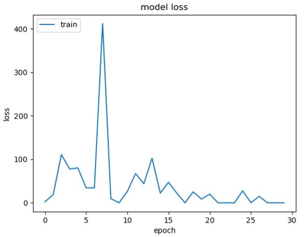

# Comp597 Project

## Classification of Upper Body Joint Movements 

With the help of new technologies, Pose Estimation has become signifi-
cantly increased in the field of motion analysis, motion tracking, etc. In
the context of this project, we have proposed a method to track the joint
movement using MediaPipe which obtains a video frame as input using
real-time camera and generates landmark points into a CSV format file.
We use this file to train a CNN model and perform the multi-class classi-
fication of the movements into normal to abnormal.

### Classification of upper body moments code files: 
This folder contains the code for data preprocessing, graph generation and the dataset that we have prepared for the classification.
### Motion_Detection_Project : 
This folder contains the video capture and the angle generation code for the shoulder, elbo and wrist joints in 3-dimension vectors. 

### Landmark Points generated by MediaPipe:

The data of various joint angles is collected using the device’s camera. The
person is made to stand at an appropriate distance of approximately 2 meters
from the camera to capture the angles efficiently. The library used to capture
the angles is open CV. Once the capturing process has been started, the per-
son is made to do a fixed set of movements, also known as the gait cycle. For
getting the angles of different joints, different movements are being captured.
For measuring the shoulder angle, shoulder abduction and adduction is being
performed. To measure the elbow angle, elbow extension and flexion is being
performed. For wrist joint measurement, the wrist is being moved up and down
in the x-y plane with respect to the camera. The number of frames captured
for each movement is approximately 50-60, here each frame is of 1 second.

### Angle generation formula :

The coordinates of the required points [(24, 12, 14, 16, 18, 20) of the right
side and (23, 11, 13, 15, 17, 1) of the left side] are passed to a function which
calculates the angle between these coordinates. 
The vectors of the joints are calculated using the x, y, and z coordinates of the joints and accordingly,
using the formula, the angle that forms between those vectors is calculated
and returned. The issue arises with the calculation of the wrist angle. Because
we do have one vector but not another for calculating the wrist angle. To
solve this, we calculate the mean vector that passes through the vectors of
the index and the pinky finger coordinates. We then use this vector with the
other one (14, 16) to find the angle of the wrist. Finally, all these angles are
stored in a csv file in the end. This file is later used for further analysis.

### Graph Generation :

In the graph, we can see the gait cycle, it is the repeated extension and
flexion of the elbow in that video frame. But in the end, our objective is to
find if that person is able to complete the movement from the least possible
angle to the maximum possible angle. If he is able to do that, his joints are
healthy else there is some issue. So, we only need the curve which shows us
the minimum and maximum possible angle. We pass this angles to a function
to get that specific curve. After getting that curve, we then normalize that
curve to the global minimum and global maximum of that entire gait cycle
graph. The normalized graph line is represented in the image below. This is
the graph line which we will be working on for classification.

### Training VGG16 Model

Since we have a very small dataset, we used transfer learning approach for
out project. We downloaded the trained weights of VGG16 model which have
been trained on ImageNet database which has million images. We are only
concerned with the input and hidden layer, because we only have two classes
to classify into, we would be creating our own output layer.

## Training Results :

We trained and tested our data on the VGG 16 model. We made use of transfer
learning and in the process, changed the output layer while freezing some layers
of VGG16. In the end, we manage to get an accuracy of 83.33%. The results are shown in the figures above.

